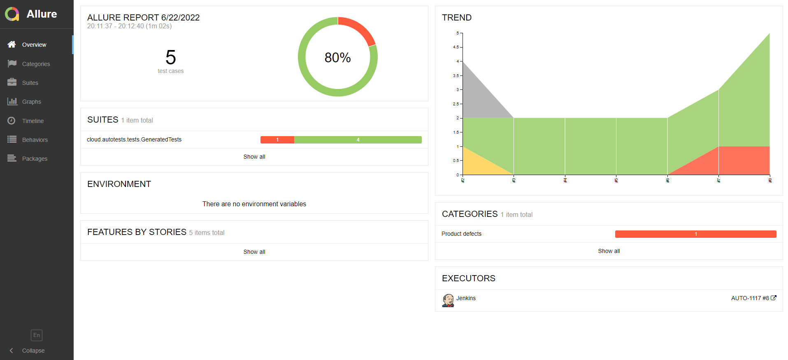
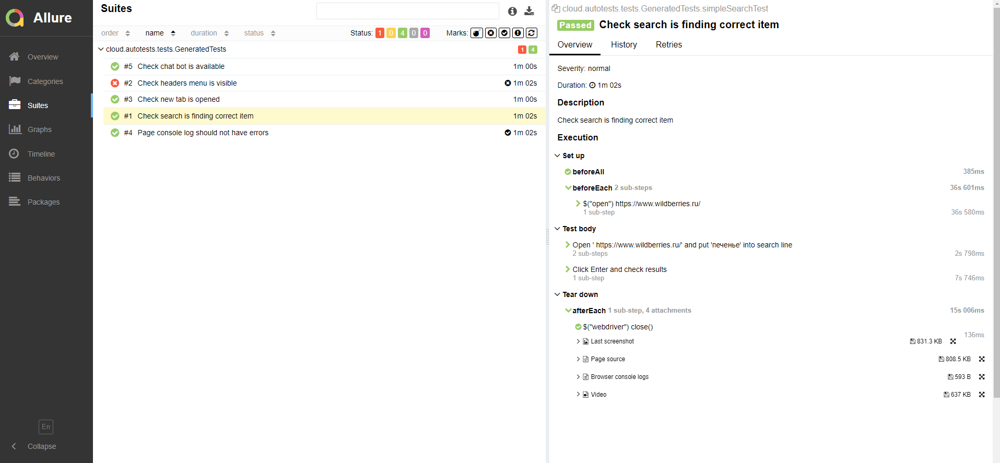
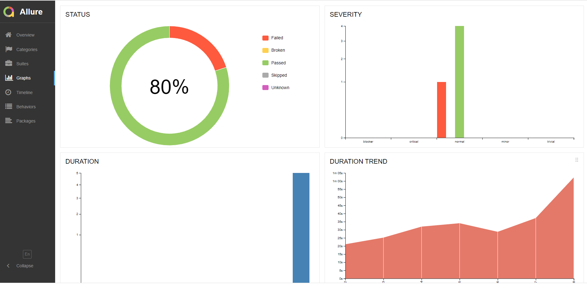
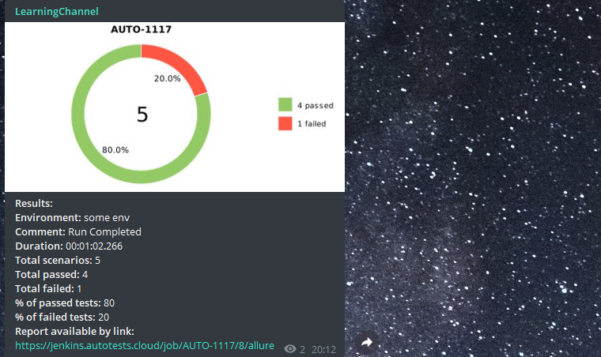

# Тестовый проект с набором автотестов для заглавной страницы Wildberries.ru

## :page_with_curl: Содержание:

- <a href="#computer-сode_stack">Технологии и инструменты</a>
- <a href="#clipboard-реализованные-проверки">Реализованные проверки</a>
- <a href="#robot-сборки-в-Jenkins">Сборки в Jenkins</a>
- <a href="#keyboard-запуск-из-терминала">Запуск из терминала</a>
- <a href="#bar_chart-allure-отчет">Allure отчет</a>
- <a href="#robot-отчет-в-telegram">Отчет в Telegram</a>
- <a href="#film_projector-видео-пример-прохождения-тестов">Видео пример прохождения тестов</a>

## :computer: Технологии и инструменты
<p align="left"> 


</p>

## :clipboard: Реализованные проверки
- Проверка ошибок в консоли :heavy_check_mark:
- Проверка функциональности поиска :heavy_check_mark:
- Проверка доступности кнопок хедера на странице :heavy_check_mark:

## :robot: Сборки в Jenkins
### <a target="_blank" href="https://jenkins.autotests.cloud/job/AUTO-1117/">Параметризированная сборка в Jenkins со всеми тестами</a>
<p align="center">

</p>

###  Главная страница сборки <a target="_blank" href="https://jenkins.autotests.cloud/job/AUTO-1117/">Jenkins</a>
<p align="center">

</p>


## :keyboard: Запуск из терминала
Локальный запуск всех тестов:
```
gradle clean test
```


Удаленный запуск всех тестов:
```
clean
test
-Dbrowser=${BROWSER}
-DbrowserVersion=${BROWSER_VERSION}
-DbrowserSize=${BROWSER_SIZE}
-DremoteDriverUrl=https://${REMOTE_DRIVER_LOGIN}:${REMOTE_DRIVER_PASSWORD}@${REMOTE_DRIVER_URL}/wd/hub/
```
### Параметры сборки

> <code>BROWSER</code> – браузер, в котором будут выполняться тесты (_по умолчанию - <code>chrome</code>_).
>
> <code>BROWSER_VERSION</code> – версия браузера, в котором будут выполняться тесты (_по умолчанию - <code>100.0</code>_).
>
> <code>BROWSER_SIZE</code> – размер окна браузера, в котором будут выполняться тесты (_по умолчанию - <code>1920x1080</code>_).
> 
> <code>BROWSER_MOBILE</code> – мобильный браузер, в котором будут выполняться тесты.
>
> <code>REMOTE_URL</code> – удаленный браузер, в котором будут выполняться тесты.
> 
> <code>LOGIN_REMOTE</code> – логин для подключения к selenoid.
> 
> <code>PASSWORD_REMOTE</code> – пароль для подключения к selenoid.
> 
> <code>THREADS</code> – количество потоков.

##  Отчет о результатах тестирования в [Allure Report](https://jenkins.autotests.cloud/job/12-Antipant-HW14/allure/)

### :pushpin: Главная страница Allure-отчета

<p align="center">

</p>

### :pushpin: Страница с тестами

<p align="center">

</p>

### :pushpin: Основной дашборд

<p align="center">

</p>


##  Уведомления в Telegram с использованием бота

> После завершения сборки бот, созданный в <code>Telegram</code>, автоматически обрабатывает и отправляет сообщение с отчетом.
<p align="center">

</p>

##  Пример запуска теста в Selenoid

К каждому тесту в отчете прилагается видео. Одно из таких видео представлено ниже.
<p align="center">

</p>


:heart: <a target="_blank" href="https://qa.guru">qa.guru</a><br/>
:blue_heart: <a target="_blank" href="https://t.me/qa_automation">t.me/qa_automation</a>
